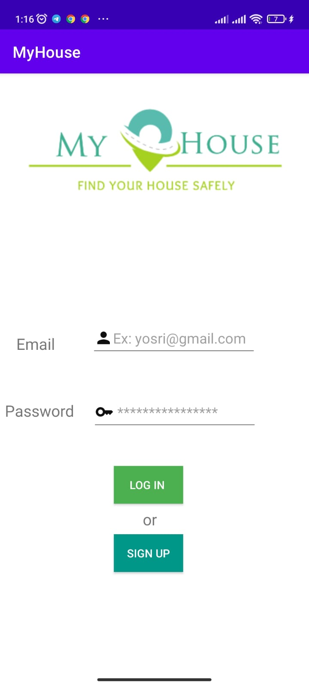
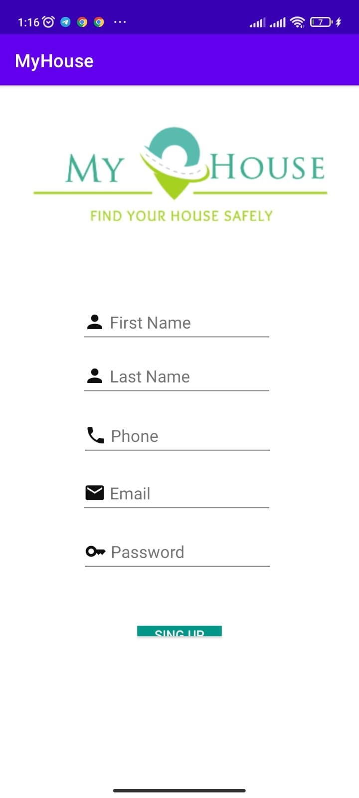
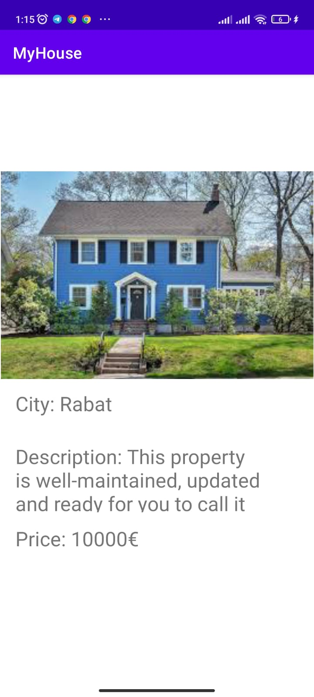
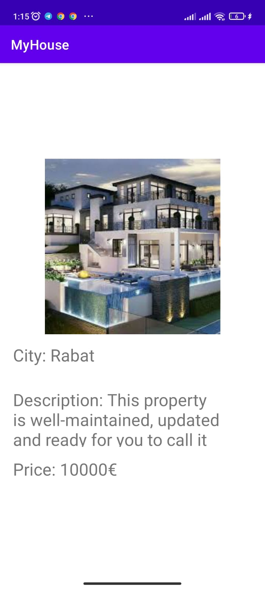

# MyHouse

Java docs [GitHub Pages](https://mohamedaymanouchker.github.io/MyHouse/com/example/myhouse/package-summary.html).

### Sign In

La page de connexion est utilisée pour permettre aux utilisateurs de s'authentifier sur  l'application en utilisant leur mail d'utilisateur et mot de passe. Lorsque l'utilisateur entre ces informations et clique sur « log in ", le système vérifie si les informations sont correctes et, si c'est le cas, authentifie l'utilisateur et lui permet d'accéder à son compte.

### Sign Up

La page d'inscription est utilisée pour collecter des informations de base sur l'utilisateur, telles que son nom et prénom d'utilisateur, le numéro de téléphone, son adresse e-mail et son mot de passe. Ces informations sont ensuite utilisées pour créer un compte pour l'utilisateur.

### Home

### Post

"Add Post"  qui permet aux utilisateurs de publier des annonces de maisons à vendre ou à louer. Il contient le nom de la ville , une petite description de la maison et le prix à vendre

### Wishlist

"Wishlist" : permet aux utilisateurs de sauvegarder les annonces qui les intéressent.

### Profile

